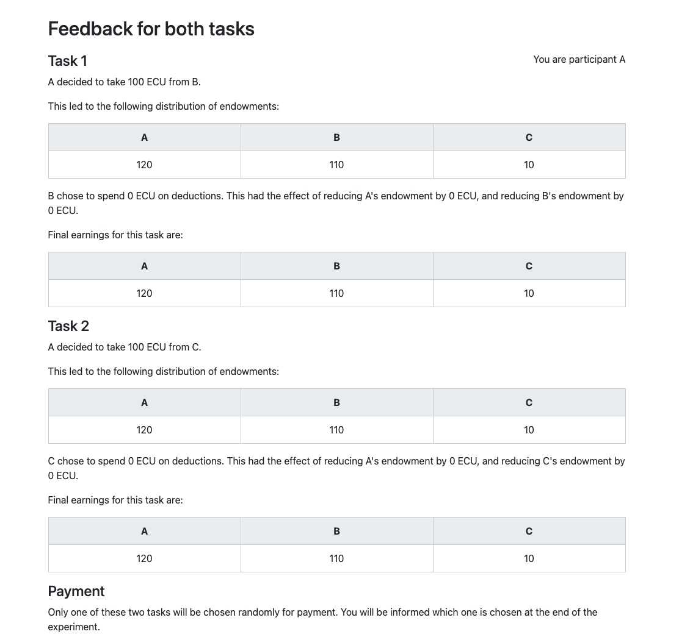

# Instructions

1. Install Docker: https://www.docker.com/products/docker-desktop
2. In **.env** edit the *APP* variable to the name of the app you want to run.
   For example, if you want to run **non_id5** do:
   ```
   APP=non_id5
   ```
3. In this folder, run the below in a terminal
   ```
   chmod +x ./run.sh
   ./run.sh prod
   ```
4. The app runs at http://localhost:8000 and the login credentials are:
	- Username: **admin**
	- Password: **otreee**

## Deploy

1. Change `APP` argument in `Dockerfile` to app that is to be deployed
2. For:
   - New deployment
     ```
     eb init -i
     eb create
     eb open
     ```
   - Current deployment
     ```
     eb deploy
     ```
3. Update the environment variables through the AWS configuration options
   (go to environment page > Configuration > Edit 'Software' > Environment
   properties). The variables for production can be found in `.prod.env`.
   Alternatively, use `eb` to set environment variables:
   ```
   eb setenv OTREE_PRODUCTION=1 ...
   ```

### Notes

- To reduce costs, first go to environment page > Configuration > Edit
  'Rolling updates and deployments' > Set deployment policy to 'Immutable'.
  Next go back to Configuration > Edit 'Capacity' > Set 'Environment type'
  to 'Single Instance'
- To clean up a deployment see [this page](https://docs.aws.amazon.com/elasticbeanstalk/latest/dg/GettingStarted.Cleanup.html)

# Group Reputation 3

## Simon To Do

- Bug

````
  File "/usr/local/lib/python3.11/site-packages/otree/models/subsession.py", line 175, in _gbat_try_to_make_new_group
    players_for_group = func(self, waiting_players)
                        ^^^^^^^^^^^^^^^^^^^^^^^^^^^
  File "/app/task2/models.py", line 56, in group_by_arrival_time_method
    group_num = waiting_players[0].participant.vars["group"]
                ~~~~~~~~~~~~~~~^^^
IndexError: list index out of range
INFO:     172.17.0.1:62592 - "POST /p/cd5jvq37/task2/Feedback/20 HTTP/1.1" 302 Found
INFO:     172.17.0.1:62592 - "GET /p/cd5jvq37/task2/Setup/22 HTTP/1.1" 200 OK
INFO:     172.17.0.1:62592 - "POST /p/x3ot5me0/task2/Feedback/20 HTTP/1.1" 302 Found
INFO:     172.17.0.1:62592 - "GET /p/x3ot5me0/task2/Setup/22 HTTP/1.1" 200 OK
````
This occurred when running a session with 9 participants, two groups were formed on birth region, one formed on political ideology. Reputation and Deterrence treatments both active. We had just finished the feedback for Task 1 when the error kicked in.

No such error occurred in a session with Det treatment switched off.

- Error in Feedback page

	Running a session with 15 participants, all grouped on political ideology, or on no criterion. Reputation Yes, Deterrence NO.

	On Feedback page after Task 2, saw this:

	

- Det/Rep -- make sure you have tested all four combinations of these config variables.
- Line 41 in FeedbackResults.html, I've put in a line saying how much A would have had deducted. But can you please amend this to say:

	> 	   This would have led to A earning 120 - {{ results.amount_reduced }} = X ECU.

	Where X updates with the correct amount.

- For all the belief questions, remove the calculate buttons
- As well as groups formed on the basis of birth region, there are groups
  formed on the basis of political ideology. And there are groups formed on
  the basis of no identity criterion. If the *latter*, they should not receive
  questions that make reference to "some group criterion". But if political ideology, they still should receive those questions.

## Toby To Do

- Confirm that nothing funny happens if a group is not based on any identity
  criterion

## Toby To Review

- Update readme to describe new variables correctly
- Yes, "chosen" task, for all participants as config variable, affects whether
  Task 1 or Task 2 is paid BUT for bonus question: 
  - Everyone gets the chance to earn a bonus from belief questions.
  - Randomize separately for each participant which belief question is to be
    rewarded. Store the name of the variable which is the basis of the bonus
    for each individual. Give them feedback about exactly which question it was
    that they are getting a bonus for on the payoff page.
- Please document in a specific readme for the group reputation 3 app):
	- How to tell whether a given group has a political/birth/no identity
    criterion
	- Explain all variables that relate to payoff
	- **Simon:** Done. Please review
